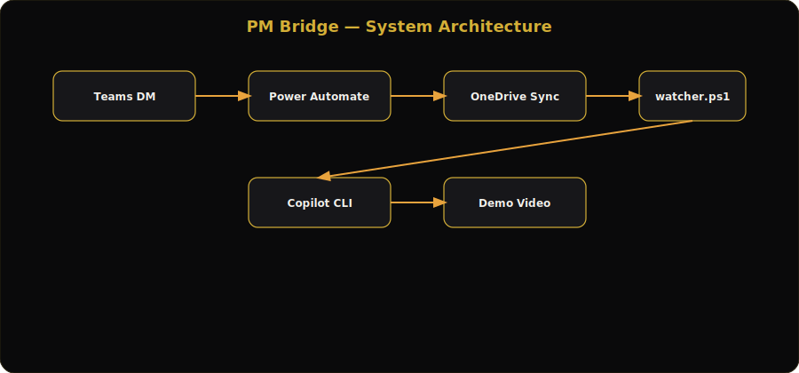
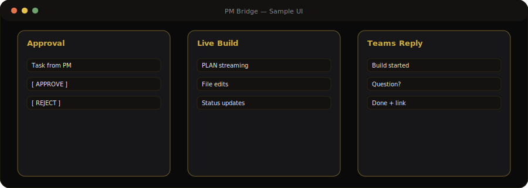

# PM Bridge (AGENT_SMSACLAW)

**Teams DM → human approval → GitHub Copilot CLI auto-build → narrated demo video back to your PM.**

No servers. No admin rights. Power Automate + OneDrive + a PowerShell watcher on your laptop.

[](https://github.com/SYLESH-1125/AGENT_SMSACLAW)
[](https://github.com/SYLESH-1125/AGENT_SMSACLAW)
[](LICENSE)

---

## Architecture



## End-to-end flow


## Sample experience



```
PM types task in Teams DM
        │
        ▼
Power Automate → OneDrive /PMBridge/inbox/<messageId>.json
        │
        ▼
watcher.ps1 → 🔔 APPROVE / REJECT popup
        ▼ approve
copilot -p "<task>" --allow-all-tools   (workspace/ only, git-committed)
        │  live progress window + Teams Q&A (--session-id)
        ▼
outbox/*.txt → Teams status    |    media/*.webm → narrated demo link
```

---

## Features

| Capability | Detail |
|------------|--------|
| **Human-in-the-loop** | Dark themed topmost approval dialog — unknown senders auto-rejected |
| **Live build viewer** | Green-on-black stream of plan, edits, and status |
| **Two-way Teams Q&A** | AI blocking questions resume the same Copilot session |
| **Narrated demos** | Playwright records glowing-cursor walkthrough with AI captions |
| **Audit trail** | Archived messages, git commits per round, transcripts in `logs/` |
| **Enterprise-safe** | Standard M365 connectors, user-scope, no inbound network |

---

## Quick start (~15 min)

1. **Prereqs:** Windows, [GitHub Copilot CLI](https://docs.github.com/copilot/how-tos/copilot-cli), Node.js, OneDrive for Business, Chrome/Edge.
2. `git clone https://github.com/SYLESH-1125/AGENT_SMSACLAW.git`
3. Copy `config.example.json` → `config.json` (paths + PM display name).
4. `cd tools && npm install`
5. Create OneDrive folders: `PMBridge/inbox`, `outbox`, `media` (*Always keep on this device*).
6. Configure three **Power Automate** flows (capture → reply → video share) — see original flow expressions in repo history.
7. Run `start-watcher.cmd` or auto-start via `.vbs` in `shell:startup`.

**Smoke test:** drop a `.txt` task file into the inbox folder without Teams.

---

## Repo layout

| File | Role |
|------|------|
| `watcher.ps1` | Poll inbox → popup → build → Q&A → outbox/media |
| `approve.ps1` | STA approval dialog (no click = reject) |
| `progress-viewer.ps1` | Live tail of current build |
| `tools/record-demo2.js` | Narrated demo recorder (Playwright) |
| `config.example.json` | Template configuration |

---

## Safety model

- Sender allowlist + explicit approval per task  
- AI confined to `workspace/`; every round git-committed  
- Unparseable input → `rejected/`, never executed  
- Share links scoped to your organization  

---

## Author

**Sylesh Pavendan** — Agentic AI & DevOps @ Cognizant · [GitHub @SYLESH-1125](https://github.com/SYLESH-1125)

## License

MIT — review your company automation & AI policies before production use.
